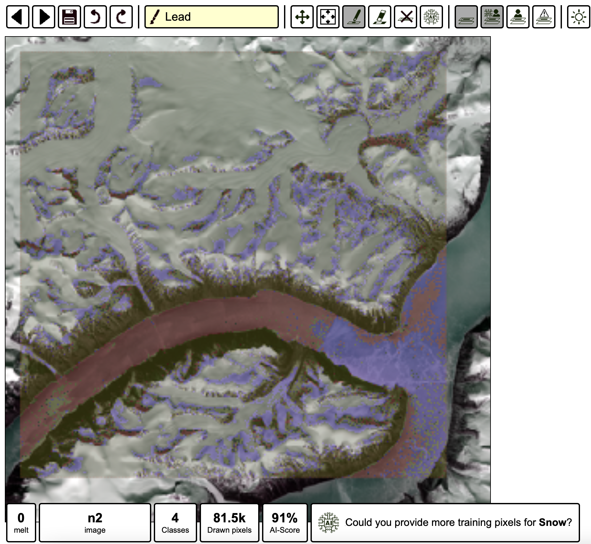

# SIOS workshop
Hands on workshop on sea ice surface AI classification techniques (<a href="https://sios-svalbard.org/AI4Svalbard">AI4Svalbard</a>, Sep 2022)

<p float="left">
  
   
   
</p>

In this session we will try and look at some recent approaches tried at <a href="http://www.cpom.ucl.ac.uk/group/">CPOM</a> UCL with colleagues to classify sea ice surface with a variety of satellite sensors and techniques. 

## Part 1 - On Google Collab 

In this part we will use a pre-processed training and testing datasets obtained from a combination of collocated optical imagery from <a href="https://sentinels.copernicus.eu/web/sentinel/technical-guides/sentinel-3-olci">OLCI</a> and radar altimetry from <a href="https://sentinels.copernicus.eu/web/sentinel/technical-guides/sentinel-3-altimetry/instrument/sral">SRAL</a>. Both instruments are onboard the <a href="https://sentinel.esa.int/web/sentinel/missions/sentinel-3">Sentinel-3</a> Copernicus satellites. 

A brief description of the algorithms to be used are included in the SIOS_AI4SeaIce.pdf document. 

## Installation 

Make sure you sign up to the free version of Google Colab prior to the session. 

You will need to download and re-upload onto Google Colab the following data and notebooks from the following link <a href="https://drive.google.com/file/d/1sNryvnz2C4zJ3L8e0tvs4dBzEg9-Rizq/view?usp=sharing">Google Drive</a>. 

Make sure to adapt the notebook to be consistent with your paths on Google Drive as below. 

```
import numpy as np
##Process the data separately and load them since processing the data takes quite some time and we don't want to process it evertime we run the model
x_test = np.load('/content/drive/MyDrive/ColabNotebooks/Data/x_test.npy')
x_train  = np.load('/content/drive/MyDrive/ColabNotebooks/Data/x_train.npy')
y_test  = np.load('/content/drive/MyDrive/ColabNotebooks/Data/y_test.npy')
y_train  = np.load('/content/drive/MyDrive/ColabNotebooks/Data/y_train.npy')
```

## Part 2 - On your laptops

In this part we will use <a href="https://github.com/ESA-PhiLab/iris">IRIS</a> - Intelligently Reinforced Image Segmentation designed for manual image segmentation and classification of satellite imagery. 

## Installation 
Clone the repository, navigate to the directory, and install the package and its dependencies. Make sure to use pip3.10 (corresponding to version of python 3.10). Installation can be a bit tricky depending on your environment.

```
git clone https://github.com/ESA-PhiLab/iris.git
cd iris
python setup.py install
```

If you are altering the IRIS source code then you may find it easier to install like below, to avoid having to reinstall it every time a change is made
```
pip install -e ./
```

## Usage

Once installed, you can run the demo version of IRIS

```
iris demo
```

## Polar example

Having run the demo, you can then create a personalised config file, based on _demo/cloud-segmentation.json_. With your own config file, you can then instantiate your own custom project

```
iris label <your-config-file>
```

Try with melt.json. You would need to first download the images directory into your working directory and duplicate it under images/n1/ and images/n2/. Once downloaded you should be able to train your image to look at melt ponds, leads, sea ice, snow and mountains. The image is from <a href="https://github.com/ESA-PhiLab/iris">Sentinel-2</a> and is over the Inuit Nunangat (North Canada) locality of Pond Inlet. 

<p float="left">
 
 
</p>

**Visit the official iris Github page:  https://github.com/ESA-PhiLab/iris**
