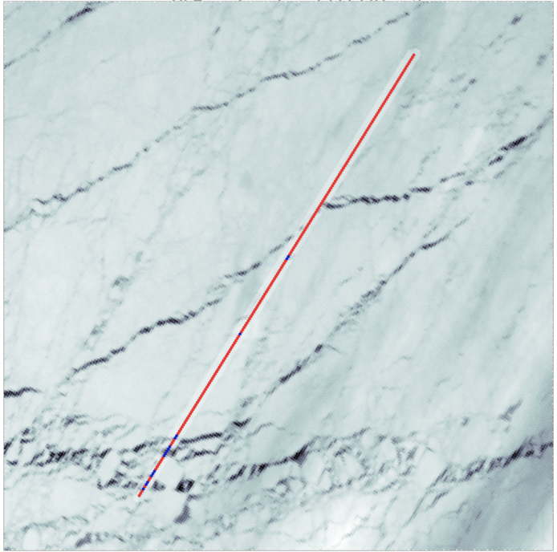
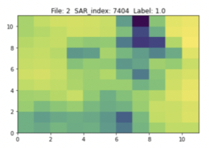
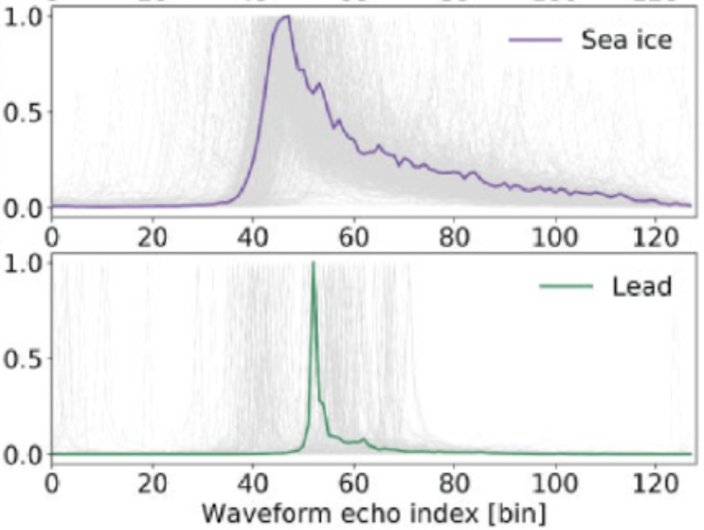

# SIOS workshop
Hands on workshop on sea ice surface AI classification techniques (<a href="https://sios-svalbard.org/AI4Svalbard">AI4Svalbard</a>, Sep 2022)

<p float="left">
  
   
   
</p>

In this session we will try and look at some recent approaches tried at <a href="http://www.cpom.ucl.ac.uk/group/">CPOM</a> UCL with colleagues to classify sea ice surface with a variety of satellite sensors and techniques. 

## Part 1 - On Google Collab 

In this part we will use a pre-processed training and testing datasets obtained from a combination of collocated optical imagery from <a href="https://sentinels.copernicus.eu/web/sentinel/technical-guides/sentinel-3-olci">OLCI</a> and radar altimetry from <a href="https://sentinels.copernicus.eu/web/sentinel/technical-guides/sentinel-3-altimetry/instrument/sral">SRAL</a>. Both instruments are onboard the Sentinel3 Copernicus satellites. 


Tool for manual image segmentation and classification of satellite imagery (or images in general). It was designed to accelerate the creation of machine learning training datasets for Earth Observation. This application is a flask app which can be run locally. Special highlights:
* Support by AI (gradient boosted decision tree) when doing image segmentation
* Multiple and configurable views for multispectral imagery
* Simple setup with pip and one configuration file
* Platform independent app (runs on Linux, Windows and Mac OS)
* Multi-user support: work in a team on your dataset and merge the results

## Part 2 - On your laptops

In this part we will use <a href="https://github.com/ESA-PhiLab/iris">IRIS</a> - Intelligently Reinforced Image Segmentation designed for manual image segmentation and classification of satellite imagery. 

## Installation 
Clone the repository, navigate to the directory, and install the package and its dependencies

```
git clone git@github.com:ESA-PhiLab/iris.git
cd iris
python setup.py install
```

If you are altering the IRIS source code then you made find it easier to install like below, to avoid having to reinstall it every time a change is made
```
pip install -e ./
```

## Usage

Once installed, you can run the demo version of IRIS

```
iris demo
```

Having run the demo, you can then create a personalised config file, based on _demo/cloud-segmentation.json_. With your own config file, you can then instantiate your own custom project

```
iris label <your-config-file>
```

**Visit the official iris Github page:  https://github.com/ESA-PhiLab/iris**
